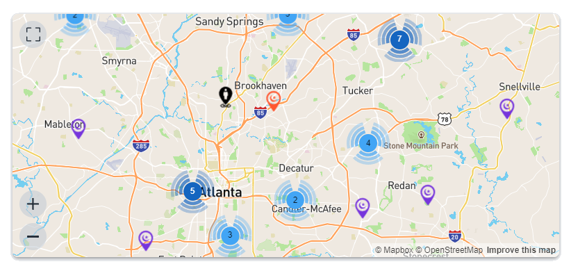
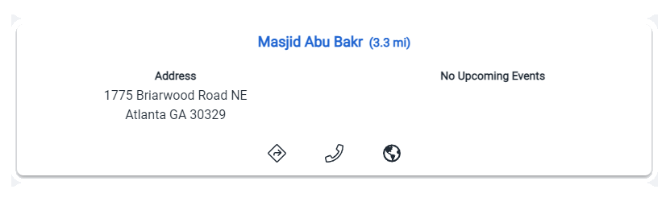

# Find places of worship

This page shows you all prayer spaces near your address.

### Search

- Type **address** of place where you would like to find prayer spaces.
- or use your gps location by clicking on  icon
- or click anywhere on the map

<!---  additionaly you can chose a search engine. defaults to  --->

### Map

Map shows 50 closest prayer spaces to your address. You can click on each icon for further details.
-  show map in full screen
-  zoom in 
-  zoom out 

### List

List shows you details for each prayer spaces.

- Click on title to go to prayer space page to view all the details
- Upcoming events show first two events coming up. View prayer space for more events.
-  call prayer space
-  diriving directions to prayer space
-  view prayer space website
