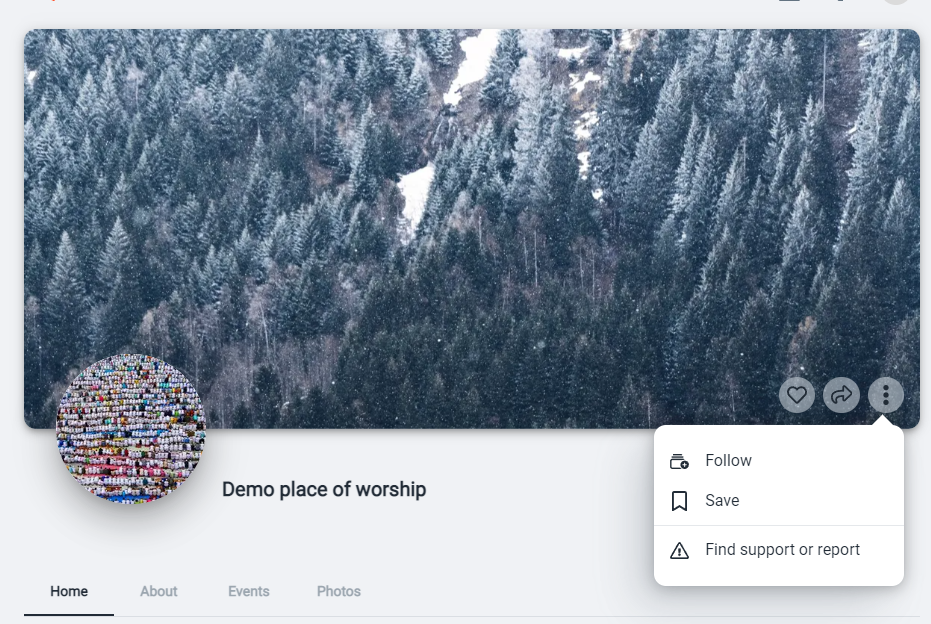
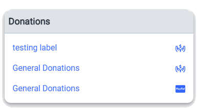
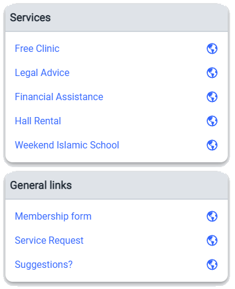
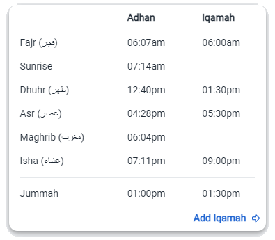
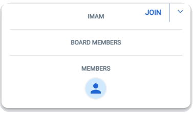
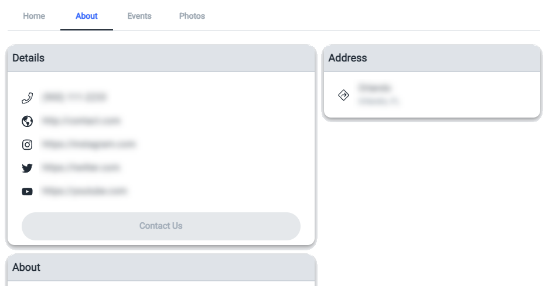

# Place of worship page
Place of worship page is where you can find out everything about specific place of worship.
You can like, follow, see what they're talking about, congregational prayer times as well as their related 

-  like this page
-  share this page
-  more options
-  follow this prayer space
-  save for later
-  Find support or report any issues to us

## Donations
MasjidPlus does not accept any donations nor do we process any payments. Each prayer space has their own donations links so you can donate to each prayer space.

## Services
Services and General links are useful links to services provided by this prayer space.

## Iqamah

## Members

# About
About tab contains contact details as well as social media links and other places where you can see posts concerning this prayer space. 

