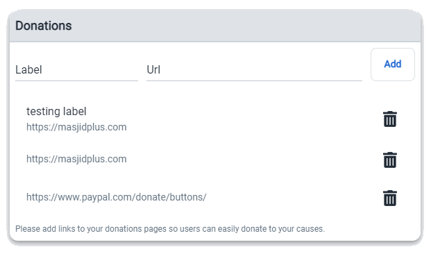
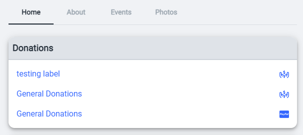

# Edit donations

Edit your prayer space then on details tab you will see donations

- Specify label such as (Masjid Donations, or Zakat, etc...)
- URL is the link to your donations page such as paypal.
- click "Add" to add donation
  - all donations will be displayed right under the form.
- You can click on  to delete donation.
- Make sure to click "Save" to save the changes.

All donations are located at the top of prayer space home page.

