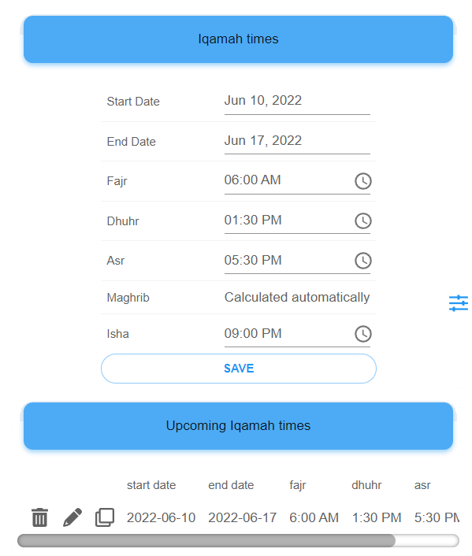

# Iqamah

See generator for a quick generation of iqamah times.

To add Iqamah time

- start date is when day when iqamah times start
- end date is the day when iqamah times end
- set iqamah time for fajr, dhuhr, asr, and isha
- click save

You can view and edit existing Iqamah times

-  to delete
-  to edit
-  clones existing iqamah times for quick entry

