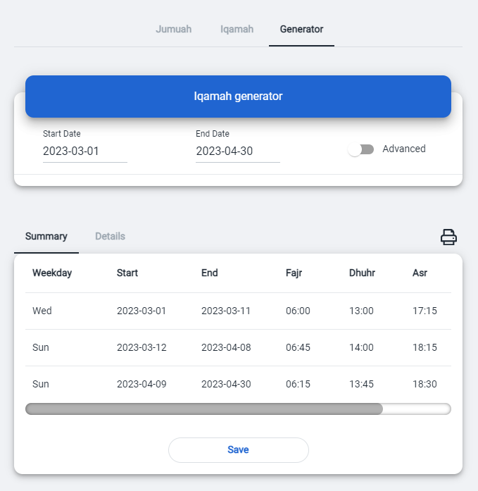

# Generator

Generator is highly customaziable tool which allows you to quickly generate Iqamah times for months ahead with minimal effort. Just set start and end dates and let it do its magic. 

With just one click, you can create a beautiful printable version as well, which you can customize  to whatever you heart desires.

Generator uses predefined settings to your region, however you can click on "Advanced" if you would like to fine tune those settings.

- set start date when calculation start
- set end date when calculation ends
- select **advanced** to fine tune the generator

**Summary** displays the dates on which the iqamah times change. Since Maghrib changes every day, it is excluded here and calculated on daily basis.

Once you are satisfied, click on Save
- so community can see them in home page
- so they can be displayed directly on the tv or anywhere with web access

If you would like to print the prayer times, click on  icon which takes you to **Print preview** page so you can customize it before printing.

