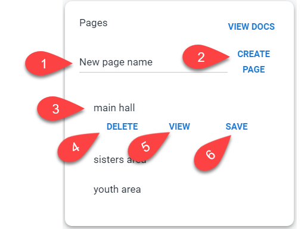

import ReactPlayer from 'react-player/youtube'

#  Pages

Pages allow you to control screen from any device. Only group admins have access to create and modify pages.

<ReactPlayer playing muted loop controls url='https://youtu.be/5XlksVwRcYA' />

#
First you give it title then click on **create page**.
All available pages will be displayed under create page.

Using your TV, click on view to display that page. (This is the only step you need to do from your TV)

Select your theme and click **save** button to save the theme for this page.
Once you save theme under selected page, your TV will display new changes.

With live updates you should see the changes instantly, otherwise you might need to wait an hour to see the changes on your TV.

1. Title of your page. Something that tells you where is the TV located
2. Click to create a new page
3. Select a page to display Options
4. Delete selected page.
5. View selected page. (Click here using your TV so you can control it from this page)
6. Any theme that is currently active (to include Prayer in Progress) will be saved to selected page once you click on Save button.

