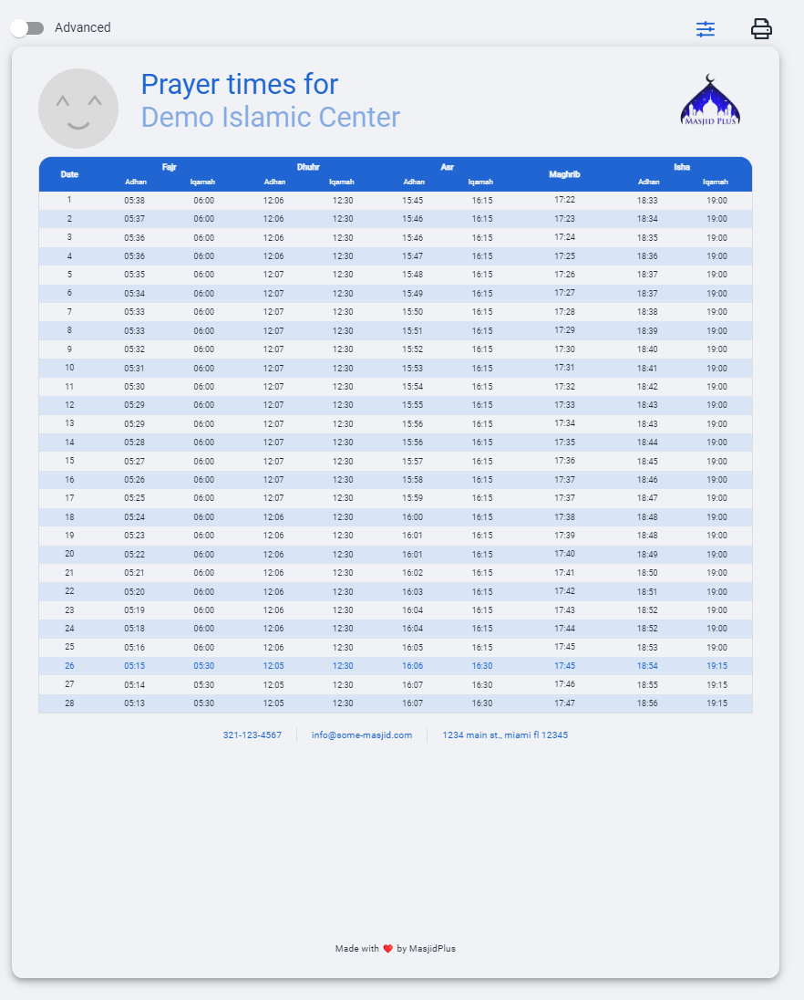
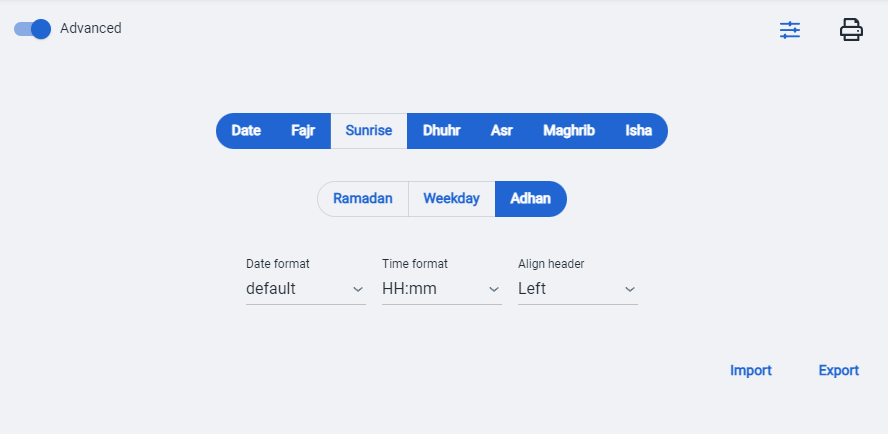
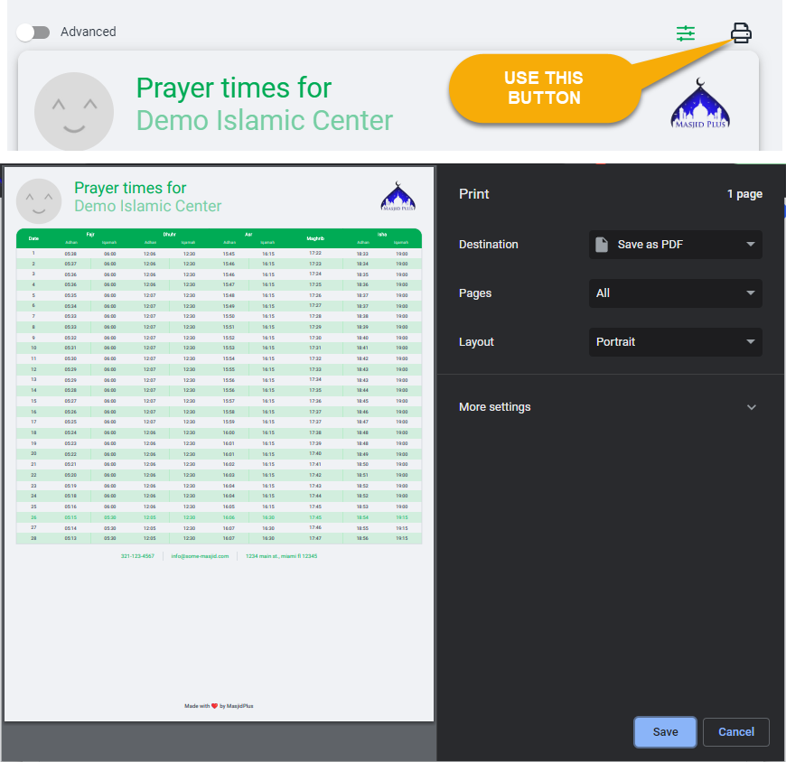

# Print preview
Print preview allows you to see what printed document would look like as well as to make any modifications you desire.

- **Logo**: Click on Logo to change the image
- **Labels**: You can click on any label to change the text.
- **Footer**: You can click on footer and add HTML and make it look any way you want to. From your 
own advertisement and logos to anything you desire.
- Click on  to change colors and font size

for more options, click on **Advanced**
- **Columns** You can toggle which columns you would like to see
- **Format** date and time as you wish

You can also **import** and **export** your settings if you would like.

#### Once you are happy with the way everything looks like, click on  icon on **top right** to print the page. 
**DO NOT USE BROWSER PRINT BUTTON** Browser will print the entire page.
Print button in **top right** corner will print only the part you want.

