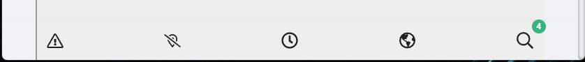
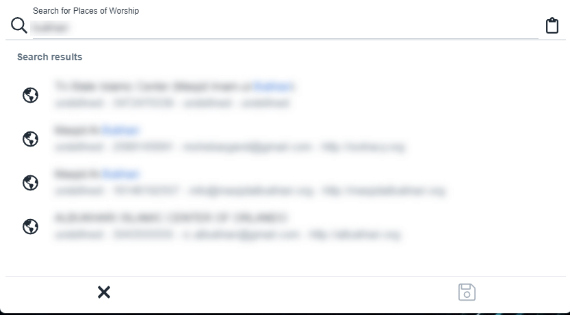

# Possible places of worship

Our automation searches for masjid using search engines like google and bing then search results are added automatically for review.

-  Mark as irrelevant.
-  Place of worship is in unsupported country
-  Link to website to view details
-  Review later
-  Click to open drawer and search our database for relevant place of worship

If you can't find the place of worhsip in our databse, then please create it, and then search again.

-  Marks this place of worhsip as relevant and adds it to our website scraper so we can pull additional information.

